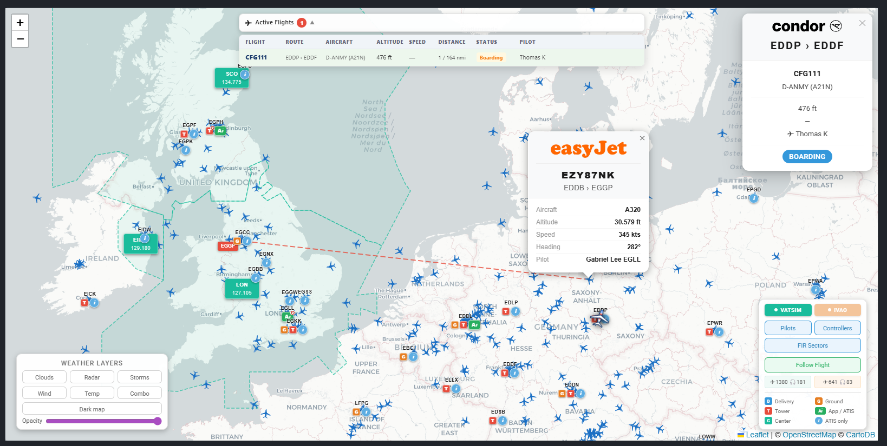

# VATSIM Live Map for phpVMS 7

A feature-rich live map widget for phpVMS 7 that integrates real-time VATSIM data alongside your Virtual Airline flights.



**Live Demo:** [german-sky-group.eu/livemap](https://german-sky-group.eu/livemap)

---

## Features

- **VATSIM Pilots** — Real-time aircraft positions with callsign, route, aircraft type, altitude, speed, heading and pilot info
- **VATSIM Controllers** — Airport markers with colour-coded badges (Delivery, Ground, Tower, Approach/ATIS, Center)
- **FIR Sectors** — Active airspace boundaries as clickable coloured polygons with controller info
- **TRACON / Approach Control** — Auto-merged into nearby airport markers (within 80 km)
- **ATIS** — Collapsible full ATIS text inside airport popup (60-char preview + "Show full ATIS")
- **Route Line** — Click any aircraft to show a dashed red line to its destination
- **VA Flight Route Line** — Click your own VA aircraft to show the route to the destination airport
- **Follow Flight** — Keeps the map centred on all active VA flights simultaneously
- **Weather Overlays** — 6 OWM layers: Clouds, Radar, Storms, Wind, Temperature, Combo + opacity slider
- **Dark Map** — Night mode with persistent state (localStorage)
- **Airline Logos** — Loaded from your phpVMS airline database (no external CDN)
- **Badge Legend** — Visual reference for all controller badge types
- **Airport Names** — Full airport names from VATSpy data in popups

---

## Requirements

- phpVMS 7 (any recent version)
- HTTPS (required for VATSIM API and OWM tiles)
- OpenWeatherMap API key (free) — **optional**, only needed for weather overlays

---

## Installation

Copy `live_map.blade.php` to the correct path for your theme:

| Theme | Path |
|-------|------|
| seven (default) | `resources/views/layouts/seven/widgets/live_map.blade.php` |
| beta | `resources/views/layouts/beta/widgets/live_map.blade.php` |
| default | `resources/views/layouts/default/widgets/live_map.blade.php` |
| SPTheme | `resources/views/layouts/SPTheme/widgets/live_map.blade.php` |
| Disposable_v3 | `resources/views/layouts/Disposable_v3/widgets/live_map.blade.php` |

> The file is identical for all themes — only the installation path differs.

---

## OpenWeatherMap API Key (optional)

Weather overlays require a free API key from [openweathermap.org](https://openweathermap.org/api).

Open `live_map.blade.php` and find **line ~750**:

```javascript
var OWM_API_KEY = "YOUR_OPENWEATHERMAP_API_KEY_HERE";
```

Replace `YOUR_OPENWEATHERMAP_API_KEY_HERE` with your key. Without a key, the Dark Map button and all other controls still work — only the weather tile overlays are disabled.

**Tip:** Use `Ctrl+F` and search for `YOUR_OPENWEATHERMAP_API_KEY_HERE` to find the line quickly.

---

## Airline Logos

Logos are loaded directly from your phpVMS **airline database** — not from external CDNs.

**How it works:**
1. The first 3 letters of a VATSIM callsign are used as the ICAO prefix (e.g. `DLH187` → `DLH`)
2. phpVMS looks up that ICAO in your Airlines table and uses the uploaded logo

**Requirements:**
- Airline created in **Admin → Airlines**
- ICAO code matches the callsign prefix (e.g. `DLH` for Lufthansa)
- Logo uploaded in the airline settings

This ensures logos are always up-to-date — for example Lufthansa's current blue crane logo instead of the old yellow one still found on most CDNs.

---

## Admin Panel Configuration (Recommended)

Set your map's default position in **Admin → ACARS**:

| Setting | Recommended (German VA) | Description |
|---------|------------------------|-------------|
| Center Coords | `51.1657,10.4515` | Geographic centre of Germany |
| Default Zoom | `5` | Shows Germany + neighbouring countries |
| Live Time | `0` | Only show flights currently in progress |
| Refresh Interval | `60` | Position update interval in seconds |

---

## VATSIM Control Panel — Button Guide

### Pilots
Toggles all active VATSIM pilots (~800+). Each aircraft shows:
- Callsign, departure → arrival, aircraft type
- Altitude, speed, heading, pilot name
- Airline logo (if available)
- Click → dashed red line to destination airport

### Controllers
Toggles airport markers with colour-coded badges:

| Badge | Colour | Meaning |
|-------|--------|---------|
| **D** | Blue | Delivery |
| **G** | Orange | Ground |
| **T** | Red | Tower |
| **Ai** | Green | Approach + ATIS |
| **A** | Green | Approach only |
| **i** | Light blue | ATIS only |
| **C** | Teal | Center / FIR |

Click any airport marker to see frequencies, controller names, ratings, online time and full ATIS text.

### FIR Sectors
Toggles active airspace boundaries as coloured dashed polygons. Clickable for controller details and sub-sector list. Only sectors with an active controller are shown.

### Follow Flight
Keeps the map view centred on your VA's active flights:
- **1 pilot online** → pans to that aircraft
- **Multiple pilots** → fits bounds to show all simultaneously
- **0 pilots** → returns to the default position set in Admin Panel

Toggle to **Free Scroll** to browse the map manually.

### Route Line (click any aircraft)
- **VATSIM aircraft** — click to show dashed red line to flight plan destination
- **VA aircraft** — click to show dashed red line to phpVMS destination airport
- Click anywhere on the map to dismiss the line

### Weather Layers
Six OWM overlay buttons (requires API key):

| Button | Layer |
|--------|-------|
| Clouds | Cloud coverage |
| Radar | Precipitation / rain radar |
| Storms | Thunderstorm cells |
| Wind | Wind speed & direction |
| Temp | Surface temperature |
| Combo | Clouds + Radar + Storms together |

**Dark Map** — inverts the base map to a night style. State is saved across browser sessions.

**Opacity slider** — adjusts transparency of all active weather layers simultaneously.

---

## Credits

- Weather overlay concept: [Rick Winkelman (Air Berlin Virtual)](https://github.com/ncd200/Weather-Overlay-on-the-Live_Map)
- VATSIM data: [VATSIM Network](https://vatsim.net) / [VATSpy Data Project](https://github.com/vatsimnetwork/vatspy-data-project)
- VATSIM integration, design & development: [German Sky Group](https://german-sky-group.eu)

---

## License

MIT License — free to use and modify. Attribution appreciated.
